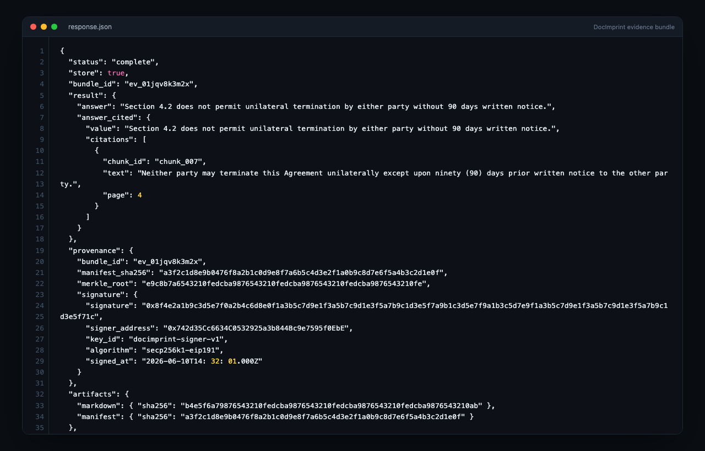
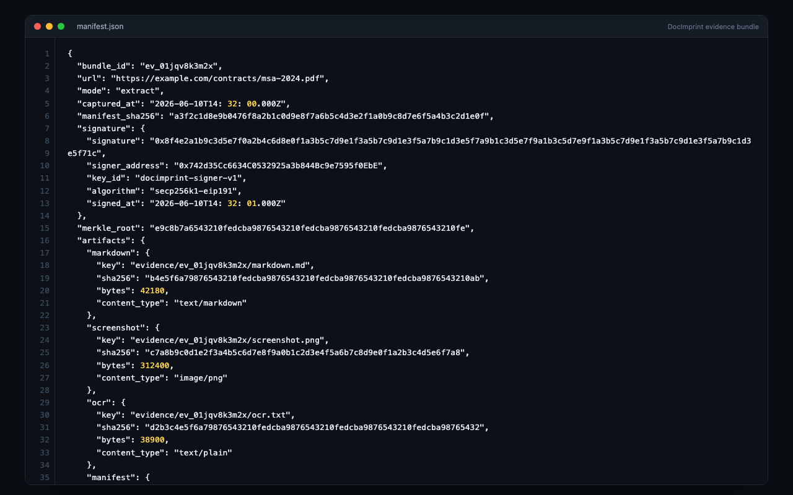
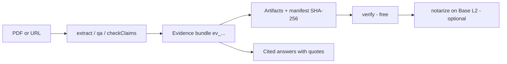
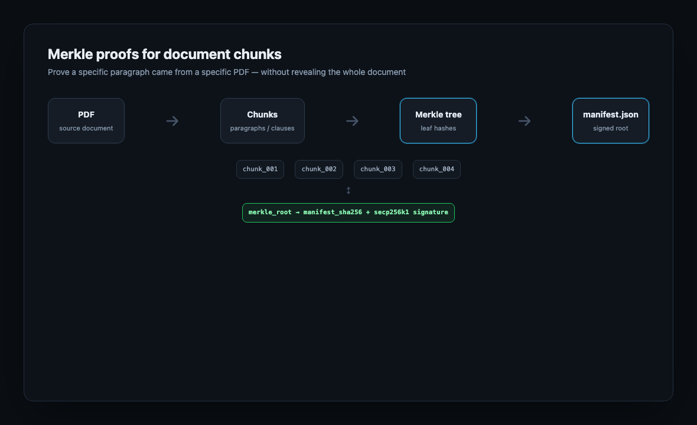

<p align="center">
  
</p>

<p align="center">
  <strong>Document memory agents can prove.</strong><br/>
  PDFs &amp; URLs → cited answers · evidence bundles · on-chain attestation
</p>

<p align="center">
  <a href="https://www.npmjs.com/package/docimprint"></a>
  <a href="https://www.npmjs.com/package/docimprint"></a>
  <a href="https://pypi.org/project/docimprint/"></a>
  <a href="https://pypi.org/project/docimprint/"></a>
  <a href="https://smithery.ai/server/docimprint"></a>
  <a href="https://glama.ai/mcp/servers/docimprint"></a>
  <a href="https://api.docimprint.com/mcp"></a>
  <a href="https://api.docimprint.com/openapi.json"></a>
  <a href="https://docimprint.com/docs"></a>
  <a href="LICENSE"></a>
  <a href="https://github.com/sawftware-apps/docimprint-sdk/stargazers"></a>
</p>

---

## Table of contents

- [At a glance](#at-a-glance)
- [Choose your integration](#choose-your-integration)
- [See what you get](#see-what-you-get)
- [How it works](#how-it-works)
- [Why not plain OCR or RAG?](#why-not-plain-ocr-or-rag)
- [Use cases](#use-cases)
- [Install](#install)
- [Quick start](#quick-start)
- [Features](#features)
- [Why DocImprint?](#why-docimprint)
- [Agent-native features](#agent-native-features)
- [CrewAI integration](#crewai-integration)
- [MCP server](#mcp-server)
- [API reference](#api-reference)
- [Error handling](#error-handling)
- [Authentication](#authentication)
- [TypeScript](#typescript)
- [Pricing](#pricing)
- [Community](#community)
- [Links](#links)

---

## At a glance

DocImprint turns any PDF or URL into a **tamper-evident evidence bundle** — structured data, AI-cited answers, and a cryptographic proof your agents can verify independently.

| | |
|---|---|
| **Input** | PDF or URL |
| **Output** | `ev_...` evidence bundle — cited answers, artifact hashes, EIP-191 signature |
| **Verify** | `client.verify()` — free, no auth; optional Base L2 notarization via EAS |

---

## Choose your integration

| Path | Best for | Start here |
|---|---|---|
| **TypeScript SDK** | Node agents, typed apps | [Quick start](#quick-start) |
| **Python SDK** | CrewAI, scripts | [Quick start](#quick-start) · [CrewAI](#crewai-integration) |
| **MCP server** | Claude, Cursor | [MCP server](#mcp-server) |
| **x402 USDC** | Autonomous agents, no account | [x402 USDC payments](#x402-usdc-payments) |

---

## See what you get

Every response includes a verifiable bundle ID, manifest hash, and cited answers tied to exact source quotes.

```json
{
  "bundle_id": "ev_01jqv8k3m2x",
  "manifest_sha256": "a3f2c1d8e9b0476f8a2b1c0d9e8f7a6b5c4d3e2f1a0b9c8d7e6f5a4b3c2d1e0f",
  "signature": {
    "signature": "0x8f4e2a1b9c3d5e7f0a2b4c6d8e0f1a3b5c7d9e1f3a5b7c9d1e3f5a7b9c1d3e5f71c",
    "signer_address": "0x742d35Cc6634C0532925a3b844Bc9e7595f0EbE",
    "algorithm": "secp256k1-eip191"
  },
  "answer_cited": {
    "value": "Section 4.2 does not permit unilateral termination without 90 days written notice.",
    "citations": [
      {
        "quote": "Neither party may terminate this Agreement unilaterally except upon ninety (90) days prior written notice to the other party.",
        "paragraphs": [42],
        "page": 4,
        "confidence": "high"
      }
    ]
  },
  "artifacts": {
    "markdown": { "sha256": "b4e5f6a79876543210fedcba9876543210fedcba9876543210fedcba9876543210ab" },
    "manifest": { "sha256": "a3f2c1d8e9b0476f8a2b1c0d9e8f7a6b5c4d3e2f1a0b9c8d7e6f5a4b3c2d1e0f" }
  }
}
```

<p align="center">
  
</p>

<p align="center">
  
</p>

---

## How it works



<p align="center">
  
</p>

---

## Why not plain OCR or RAG?

| | Plain OCR | Vector RAG | DocImprint |
|---|---|---|---|
| Exact source quotes | No | Approximate | Yes, with paragraph refs |
| Tamper evidence | No | No | SHA-256 manifest + EIP-191 sig |
| Independent verify | No | No | `verify()` without API key |
| On-chain attestation | No | No | EAS on Base L2 |
| Agent audit trail | No | No | Provenance + handoff (Python) |

---

## Use cases

| Scenario | Method | Result |
|---|---|---|
| **Contract Q&A** | `client.qa()` | Cited answer with confidence score |
| **Claim verification** | `client.checkClaims()` | Per-claim verdict: `supported` / `contradicted` / `not_found` |
| **Invoice intake** | `client.extract({ mode: 'invoice' })` | Structured merchant, line items, totals — all cited |
| **Compliance archive** | `legal_hold: true` + `notarize()` | Immutable on-chain record, deletion blocked |

---

## Install

```bash
npm install docimprint           # TypeScript / Node.js
```

```bash
pip install docimprint           # Python REST client
pip install "docimprint[crewai]" # + 10 CrewAI tools & ProvenanceTracker
```

Python source lives in [`python/`](python/). PyPI: [docimprint](https://pypi.org/project/docimprint/).

---

## Quick start

Get an API key at [docimprint.com](https://docimprint.com) — free tier available, no credit card required.

**TypeScript**

```typescript
import { DocImprintClient } from 'docimprint'

const client = new DocImprintClient({ apiKey: 'dr_live_...' })

const result = await client.extract({
  source: 'https://example.com/contract.pdf',
  include: ['markdown', 'summary'],
})

console.log(result.bundle_id)        // ev_01j...
console.log(result.summary)          // AI-generated summary
console.log(result.manifest_sha256)  // tamper-evident hash
console.log(result.key_points_cited[0].citations[0].quote)
```

**Python**

```python
from docimprint import DocImprintClient

client = DocImprintClient(api_key="dr_live_...")

result = client.extract(
    url="https://example.com/contract.pdf",
    include=["markdown", "summary"],
)
print(result["bundle_id"])         # ev_01j...
print(result["summary"])           # AI-generated summary
print(result["manifest_sha256"])   # tamper-evident hash
```

**REST API (cURL)**

```bash
curl -X POST https://api.docimprint.com/v1/extract \
  -H "Authorization: Bearer dr_live_..." \
  -H "Content-Type: application/json" \
  -d '{"source": "https://example.com/contract.pdf", "include": ["markdown", "summary"]}'
```

---

## Features

| Capability | Method / Mode | Description |
|---|---|---|
| **Extract** | `extract()` | Full evidence bundle — markdown, summary, cited key points, artifacts, manifest SHA-256 |
| **Invoice parsing** | `mode: 'invoice'` | Structured `InvoiceResult`: merchant, date, line items, subtotal, tax, total — all with citations |
| **Document comparison** | `mode: 'compare'` | Diff two documents; supply `previous_bundle_id` to track changes |
| **Structured extraction** | `mode: 'extract-structured'` | Extract typed fields using a caller-defined JSON Schema |
| **Summarize** | `summarize()` | Prose summary + key points, each with cited paragraph references |
| **Q&A** | `qa()` | Single-question answer with inline citations and confidence score |
| **Claim-check** | `checkClaims()` | Per-claim verdict: `supported` / `contradicted` / `not_found` with evidence quotes |
| **Translate** | `translate()` | Source-cited translation to any language |
| **Describe** | `describe()` | AI description of image or PDF page contents |
| **Collections** | `createCollection()` + `searchCollection()` + `askCollection()` | Semantic search + cross-document RAG Q&A across multiple bundles |
| **Verify** | `verify()` | Cryptographic integrity check — manifest hash, EIP-191 signature, artifact hashes. Free, no auth |
| **Notarize** | `notarize()` | Write manifest SHA-256 to Base L2 via EAS — permanent, immutable attestation |
| **MCP server** | 20 tools · 2 prompts | Native MCP for Claude, Cursor, and any MCP-compatible client |
| **x402** | REST `X-Payment` header | Pay per call in USDC — no account required |

---

## Why DocImprint?

- 🔏 **Cryptographic provenance** — every bundle is EIP-191 signed at creation; optionally notarized on Base L2 via EAS for an immutable on-chain audit trail
- 🤖 **Agent-native by design** — async jobs, webhooks, idempotency keys, and legal hold built into every request, not bolted on
- 📎 **Beyond OCR** — citations carry exact quotes, paragraph indices, and confidence scores (`high`/`medium`/`low`), not just raw text
- 🛠️ **10 CrewAI tools out of the box** — `research_tools()`, `legal_tools()`, `collection_tools()` pre-grouped for common agent workflows
- ⚖️ **Compliance-ready** — `legal_hold`, provenance logging, multi-agent handoff tracking, and on-chain notarization designed for legal and regulated industries
- 💳 **Flexible payment** — monthly credit plans or pay-per-call USDC via x402, no account required

---

## Agent-native features

DocImprint is designed for autonomous agent workflows, not just synchronous API calls.

```typescript
// Fire-and-forget async extraction — returns job_id immediately
const job = await client.extract({
  source: 'https://example.com/large-report.pdf',
  async: true,
  webhook: 'https://your-agent.io/callback',
  idempotency_key: 'report-2025-q4',
  legal_hold: true,
})

const status = await client.getJob(job.job_id)
// { status: 'complete', bundle_id: 'ev_...', progress_pct: 100 }

// Monitor a URL for changes — get notified on diff
await client.extract({
  source: 'https://example.com/terms.html',
  monitor: { webhook: 'https://your-agent.io/changes', mode: 'diff' },
})
```

**Python: provenance & multi-agent handoff tracking**

```python
client.log_provenance(bundle_id="ev_...", agent_id="agent-research", action="extracted")
client.handoff(bundle_id="ev_...", from_agent="agent-research", to_agent="agent-legal", note="ready for claim check")
```

---

## CrewAI integration

10 purpose-built tools for CrewAI agents, organized into preset groups.

```python
from docimprint.crewai import DocImprintToolkit

toolkit = DocImprintToolkit(
    api_key="dr_live_...",
    collection_id="col_...",  # required for collection tools
)

toolkit.research_tools()      # extract, summarize, qa, check_claims
toolkit.legal_tools()         # check_claims, verify, notarize
toolkit.collection_tools()    # search, ask, add_to_collection
toolkit.all_tools()           # all 10 tools
```

| Tool | What it does |
|------|---|
| `ExtractEvidenceTool` | Full evidence bundle with citations and manifest hash |
| `SummarizeTool` | Key points with cited paragraph references |
| `QATool` | Cited answer with confidence score |
| `CheckClaimsTool` | Per-claim verdict: supported / contradicted / not_found |
| `TranslateTool` | Source-cited translation |
| `VerifyBundleTool` | Cryptographic integrity check — manifest, hash, signature |
| `NotarizeTool` | On-chain EAS attestation on Base L2 |
| `SearchCollectionTool` | Semantic vector search across document collection |
| `AskCollectionTool` | Cross-document RAG Q&A with cited sources |
| `AddToCollectionTool` | Add bundle to collection and trigger async indexing |

**ProvenanceTracker** wraps all tools to automatically log agent actions and bundle handoffs.

```python
from docimprint.crewai import DocImprintToolkit, ProvenanceTracker

tracker = ProvenanceTracker(client=toolkit.client)
trackable = toolkit.trackable_tools()
```

**DocImprintKnowledgeSource** integrates with CrewAI's knowledge system for retrieval-augmented agents.

---

## MCP server

DocImprint exposes a native MCP server for use with Claude, Cursor, and any MCP-compatible client.

**Install via Smithery (one command):**
```bash
npx @smithery/cli install docimprint --client claude
```

**Manual config:**
```json
{
  "mcpServers": {
    "docimprint": {
      "type": "streamable-http",
      "url": "https://api.docimprint.com/mcp",
      "headers": {
        "Authorization": "Bearer dr_live_..."
      }
    }
  }
}
```

Transport: `streamable-http` · Auth: Bearer token · [Listed on Smithery](https://smithery.ai/server/docimprint) · [Listed on Glama](https://glama.ai/mcp/servers/docimprint)

### MCP tools

**URL tools** — lean mode, no bundle stored:

| Tool | Description |
|------|---|
| `extract_url` | Fetch URL → text + metadata |
| `summarize_url` | Fetch URL → prose summary + key points |
| `qa_url` | Fetch URL → cited answer to a specific question |
| `translate_url` | Fetch URL → translated content |

**Document tools** — accepts base64 PDF or image:

| Tool | Description |
|------|---|
| `extract_text` | OCR plain text from PDF / image |
| `extract_tables` | OCR tables as Markdown from PDF / image |
| `parse_invoice` | Structured invoice fields: merchant, line items, totals + citations |
| `summarize_document` | Prose summary + cited key points |
| `check_claims` | Per-claim verdict with evidence quotes |
| `extract_structured` | Extract typed fields using a caller-defined schema |

**Bundle & collections:**

| Tool | Description |
|------|---|
| `verify_bundle` | Cryptographic integrity check |
| `get_bundle` | Bundle metadata and notarization status |
| `notarize_bundle` | On-chain EAS attestation on Base L2 |
| `create_collection` | Create a named document collection |
| `list_collections` | List your collections |
| `add_document_to_collection` | Add bundle + trigger async indexing |
| `search_collection` | Semantic vector search |
| `ask_collection` | Cross-document RAG Q&A |
| `get_job_status` | Poll async job (extract, indexing, batch) |
| `get_quota` | Check credit balance and plan status |

**Guided prompts:** `claim_check_workflow` · `invoice_intake`

**Resource:** `bundle://{bundle_id}` — read bundle metadata directly

---

## API reference

Full typed reference: [docimprint.com/docs](https://docimprint.com/docs) · [OpenAPI](https://api.docimprint.com/openapi.json)

| Category | Methods |
|---|---|
| **Core** | `extract`, `verify`, `download`, `notarize`, `deleteBundle` |
| **Focused** | `summarize`, `qa`, `translate`, `checkClaims`, `describe` |
| **Extract modes** | `invoice`, `extract-structured`, `compare`, `store: false` (lean) |
| **Collections** | `createCollection`, `listCollections`, `addToCollection`, `searchCollection`, `askCollection` |
| **Jobs** | `getJob`, `listJobs`, `getQuota` |

---

## Error handling

```typescript
import { DocImprintClient, DocImprintError } from 'docimprint'

try {
  const result = await client.extract({ source: 'https://example.com/doc.pdf' })
} catch (err) {
  if (err instanceof DocImprintError) {
    console.error(err.message)    // human-readable error
    console.error(err.status)     // HTTP status code
    console.error(err.requestId)  // x-request-id for support
  }
}
```

---

## Authentication

### API key

Monthly credits via Stripe — sign up at [docimprint.com](https://docimprint.com), free tier available:

```typescript
const client = new DocImprintClient({ apiKey: 'dr_live_...' })
```

### x402 USDC payments

DocImprint supports the [x402 open standard](https://x402.org) — pay per call in USDC on Base, straight from any EVM wallet. **No account. No sign-up. No API key.** Your agent can call the API autonomously without any human-managed credentials.

The API is x402-native: it returns a standard `402 Payment Required` response with on-chain payment details, your client settles in USDC, and the request completes automatically. From $0.01 / call.

**With `@x402/fetch` (automatic payment handling):**

```typescript
import { wrapFetchWithPayment } from '@x402/fetch'
import { createWalletClient, http } from 'viem'
import { privateKeyToAccount } from 'viem/accounts'
import { base } from 'viem/chains'

const account = privateKeyToAccount('0x...')
const wallet = createWalletClient({ account, chain: base, transport: http() })

const fetchWithPayment = wrapFetchWithPayment(fetch, wallet)

const res = await fetchWithPayment('https://api.docimprint.com/v1/summarize', {
  method: 'POST',
  headers: { 'Content-Type': 'application/json' },
  body: JSON.stringify({ source: 'https://example.com/report.pdf' }),
})
const data = await res.json()
```

**Identity on owner routes:** For `GET`/`DELETE` operations that require ownership (e.g. fetching your bundle), pass the `payment-signature` header from a prior payment response so the API can verify your wallet address without a separate login.

---

## TypeScript

All request and response types are exported:

```typescript
import type {
  ExtractRequest,
  ExtractResponse,
  Citation,
  CitedField,
  InvoiceResult,
  Job,
  Collection,
  SearchResult,
} from 'docimprint'
```

---

## Pricing

Free tier available — no credit card required. Monthly credit plans via Stripe, or pay per call in USDC via x402. [See pricing →](https://docimprint.com/pricing)

---

## Community

Questions, integrations, and announcements: [GitHub Discussions](https://github.com/sawftware-apps/docimprint-sdk/discussions).

---

## Links

- [Documentation](https://docimprint.com/docs)
- [API Reference](https://api.docimprint.com/openapi.json)
- [Evidence bundles](https://docimprint.com/evidence-bundles)
- [x402 payments](https://docimprint.com/x402)
- [Pricing](https://docimprint.com/pricing)
