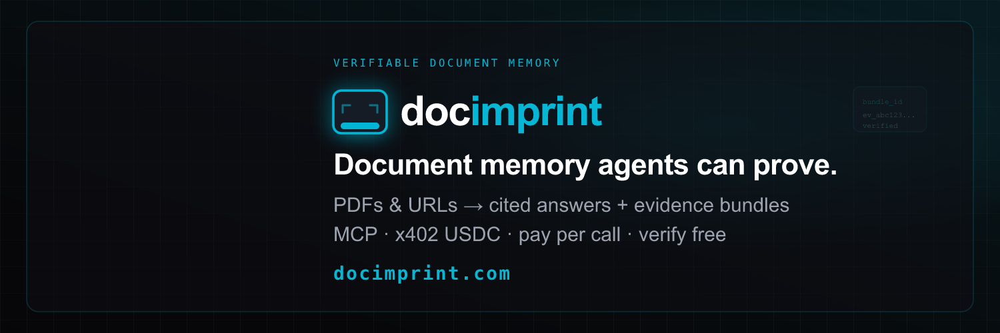

<p align="center">
  
</p>

<p align="center">
  <strong>Document memory agents can prove.</strong><br/>
  PDFs & URLs → cited answers · evidence bundles · on-chain attestation
</p>

<p align="center">
  <a href="https://www.npmjs.com/package/docimprint"></a>
  <a href="https://www.npmjs.com/package/docimprint"></a>
  <a href="https://www.npmjs.com/package/docimprint"></a>
  <a href="https://docimprint.com/docs"></a>
  <a href="https://api.docimprint.com/mcp"></a>
  <a href="https://api.docimprint.com/openapi.json"></a>
</p>

---

## What is DocImprint?

DocImprint turns any PDF or URL into a **tamper-evident evidence bundle** — structured data, AI-cited answers, and a cryptographic proof your agents can verify independently.

| Feature | Description |
|---------|-------------|
| **Extract** | Markdown, tables, structured data, invoice parsing |
| **Summarize & Q&A** | AI answers with inline citations and confidence scores |
| **Claim-check** | Verify factual claims against the source document |
| **Collections** | Cross-document semantic search and Q&A |
| **Notarize** | On-chain attestation via Base L2 (EAS) |
| **MCP server** | Native tool support for Claude, GPT, and any MCP client |
| **x402 payments** | Pay per call with USDC — no account required |

---

## Install

```bash
npm install docimprint
```

### Python + CrewAI

```bash
pip install docimprint           # REST client
pip install "docimprint[crewai]"  # + CrewAI tools & toolkit
```

Source lives in [`python/`](python/) in this repo. PyPI: [docimprint](https://pypi.org/project/docimprint/).

---

## Quick start

```typescript
import { DocImprintClient } from 'docimprint'

const client = new DocImprintClient({ apiKey: 'dr_live_...' })

// Extract a PDF and get a verifiable evidence bundle
const result = await client.extract({
  source: 'https://example.com/contract.pdf',
  include: ['markdown', 'summary'],
})

console.log(result.bundle_id)        // ev_01j...
console.log(result.summary)          // AI-generated summary
console.log(result.manifest_sha256)  // tamper-evident hash
```

Get an API key at [docimprint.com](https://docimprint.com).

---

## Methods

### Core

```typescript
// Extract with evidence bundle
client.extract(params: ExtractRequest): Promise<ExtractResponse>

// Verify bundle integrity — free, no auth required
client.verify(bundleId: string, quick?: boolean): Promise<VerifyResponse>

// Download bundle ZIP
client.download(bundleId: string): Promise<Response>

// Notarize on Base L2 ($0.05)
client.notarize(bundleId: string): Promise<NotarizeResponse>

// Delete bundle
client.deleteBundle(bundleId: string, opts?: { acknowledgeNotarized?: boolean }): Promise<void>
```

### Focused endpoints

```typescript
// Summarize ($0.018)
client.summarize(params: SummarizeRequest): Promise<SummarizeResponse>

// Question & answer ($0.022)
client.qa(params: QARequest): Promise<QAResponse>

// Translate ($0.040)
client.translate(params: TranslateRequest): Promise<TranslateResponse>

// Claim-check ($0.025)
client.checkClaims(params: CheckClaimsRequest): Promise<CheckClaimsResponse>

// Describe image or PDF ($0.018)
client.describe(params: DescribeRequest): Promise<DescribeResponse>
```

### Async jobs

```typescript
// Get remaining API key quota
client.getQuota(): Promise<{ credits_remaining: number; credits_total: number; resets_at: string }>

// Poll a job by ID
client.getJob(jobId: string): Promise<Job>

// List jobs with optional filters
client.listJobs(opts?: { status?, limit?, offset? }): Promise<{ jobs: Job[] }>
```

### Collections

```typescript
// Create a named collection
client.createCollection({ name: 'Q4 Contracts' }): Promise<Collection>

// List all collections
client.listCollections(): Promise<{ collections: Collection[] }>

// Add a bundle to a collection
client.addToCollection(collectionId, { bundle_id }): Promise<void>

// Semantic search across documents
client.searchCollection(collectionId, { query, limit? }): Promise<SearchCollectionResponse>

// Cross-document Q&A with citations
client.askCollection(collectionId, { question, limit? }): Promise<AskCollectionResponse>
```

---

## Error handling

```typescript
import { DocImprintClient, DocImprintError } from 'docimprint'

try {
  const result = await client.extract({ source: 'https://example.com/doc.pdf' })
} catch (err) {
  if (err instanceof DocImprintError) {
    console.error(err.message)    // human-readable error
    console.error(err.status)     // HTTP status code
    console.error(err.requestId)  // x-request-id for support
  }
}
```

---

## Authentication

**API key** — monthly credits via Stripe:
```typescript
const client = new DocImprintClient({ apiKey: 'dr_live_...' })
```

**x402 USDC** — pay per call, no account required. Use the raw API directly with the `X-Payment` header. See [x402 docs](https://docimprint.com/x402).

---

## TypeScript

All request and response types are exported:

```typescript
import type {
  ExtractRequest,
  ExtractResponse,
  Job,
  Collection,
  SearchResult,
} from 'docimprint'
```

---

## MCP server

DocImprint exposes a native MCP server for use with Claude, Cursor, and any MCP-compatible client:

```
https://api.docimprint.com/mcp
```

Transport: `streamable-http` · Auth: Bearer token (your API key)

---

## Community

Questions, integrations, and announcements: [GitHub Discussions](https://github.com/sawftware-apps/docimprint-sdk/discussions).

---

## Links

- [Documentation](https://docimprint.com/docs)
- [API Reference](https://api.docimprint.com/openapi.json)
- [Evidence bundles](https://docimprint.com/evidence-bundles)
- [x402 payments](https://docimprint.com/x402)
- [Pricing](https://docimprint.com/pricing)
